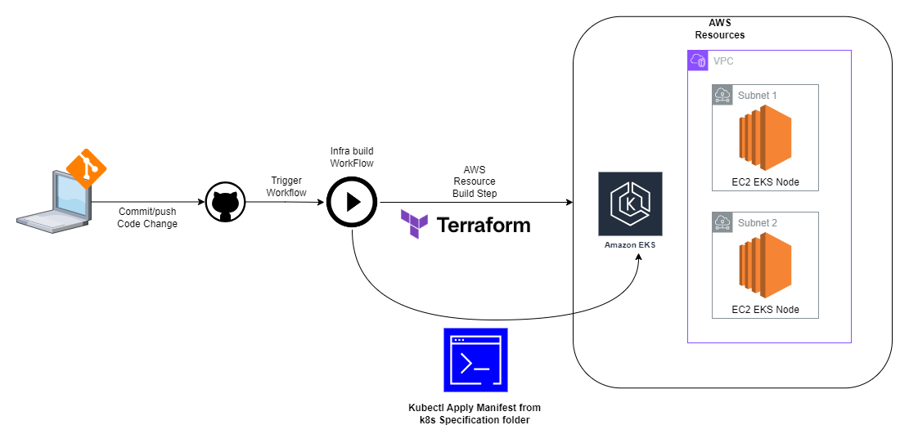
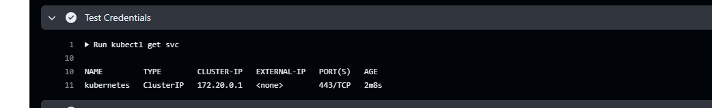

# Option
Option 1

# Workflow Diagram

# Approach
1. Forked the sample repository.
2. Since the preferred technology stack is AWS, I have decide to use the EKS service of AWS. 
3. To create the AWS resources such as VPC, EKS and EKS Node I have used Terraform as IaC tooling. [Here is the Terraform Code](./infra/)
4. To automate the deployment, I have created [Here is the workflow code.](./.github/workflows/build-infra.yaml).
5. The workflow will apply the terraform code and then apply the kubernetes manifest.

# Justification
Since there are already prepared K8s manifest files, I have decided to use Kubernetes as the platform of the sample application. Opting for EKS as the service provider streamlines cluster management, reducing the need for extensive administration. Furthermore, the implementation of Terraform for infrastructure as code (IaC) facilitates the replication of the Kubernetes Cluster across various environments with ease.

#Notes
1. I have commented out the EKS Node Pool code because my AWS account block the deployment of EC2. Sorry for that.
2. Since there is no node pool, I have commented out the Kubernetes Manifest deployment step on the Build Infra workflow. 
3. To make sure that the Github Runner has access to the created EKS environment, I have tested kubectl get service command from the worklow.
